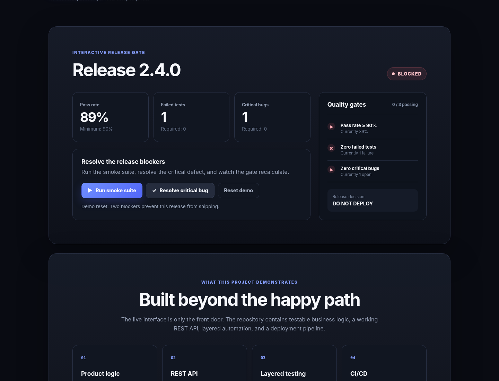

# Release Readiness Dashboard

[](https://github.com/dillon-olivi/release-readiness-demo/actions/workflows/quality-and-pages.yml)
[](https://dillon-olivi.github.io/release-readiness-demo/)

**[Open the live demo](https://dillon-olivi.github.io/release-readiness-demo/)** · **[View the automated test report](https://dillon-olivi.github.io/release-readiness-demo/test-report/)**



A small release-management application I built to demonstrate software development and test automation across unit, API, and browser layers.

The dashboard begins with a release that is blocked by a failed smoke test and an open critical defect. As those problems are resolved, the shared release rules recalculate the quality gates and determine whether deployment is allowed.

## Project highlights

- Interactive browser-based release workflow
- Shared JavaScript business logic used by both the UI and API
- Node.js REST API with input validation and error handling
- Unit tests for release rules
- Playwright API tests for contracts, state changes, and invalid input
- Playwright UI tests for the critical user workflow
- GitHub Actions pipeline that tests every change before deployment
- Published Playwright report with traces, screenshots, and video on failure

## How it works

### Application flow

```text
User opens the dashboard
        ↓
User runs the smoke suite or resolves the critical bug
        ↓
The release data changes
        ↓
Shared release rules calculate READY or BLOCKED
        ↓
The dashboard displays the updated decision

Code is pushed to GitHub
        ↓
GitHub Actions starts
        ↓
Unit, API, and browser tests run
        ↓
A Playwright test report is generated
        ↓
The live demo deploys only if the tests pass
```

The browser demo and Node.js API both use `calculateReleaseSummary()` from `src/public/release-logic.js`. Keeping the release rules separate from the UI and server makes the behavior easier to test and avoids duplicating business logic.

## Test coverage

| Layer | Purpose |
| --- | --- |
| Unit | Verifies release decisions and request validation in isolation |
| API | Verifies response contracts, state changes, and malformed requests |
| UI | Verifies the user can move a release from blocked to ready and reset the demo |

## Continuous integration

The workflow in `.github/workflows/quality-and-pages.yml` runs whenever code is pushed or a pull request is opened.

1. Installs the project dependencies and Chromium.
2. Runs the unit, API, and browser test suites.
3. Uploads the Playwright report as a workflow artifact.
4. Deploys the live site and report only after the tests pass.

## Run locally

Local setup is optional because the demo and test report are already published.

```bash
npm install
npx playwright install chromium
npm test
npm start
```

Then open `http://127.0.0.1:3000`.

## Repository structure

```text
src/
  public/
    index.html            Dashboard structure and content
    app.js                Interactive workflow
    release-logic.js      Shared release rules
    styles.css            Responsive interface
  server.js               Node.js server and REST API
tests/
  unit/                    Business-rule tests
  api/                     REST API tests
  ui/                      Browser workflow tests
.github/workflows/
  quality-and-pages.yml   Test, report, and deployment pipeline
```

## Possible next steps

- Persist release history instead of keeping it in memory
- Add schema-based API validation
- Add authentication and role-based permissions
- Expand test coverage across multiple browsers
- Add pull-request quality gates and coverage reporting

---

Built by **Dillon Olivi** as an SDET and software engineering portfolio project.
